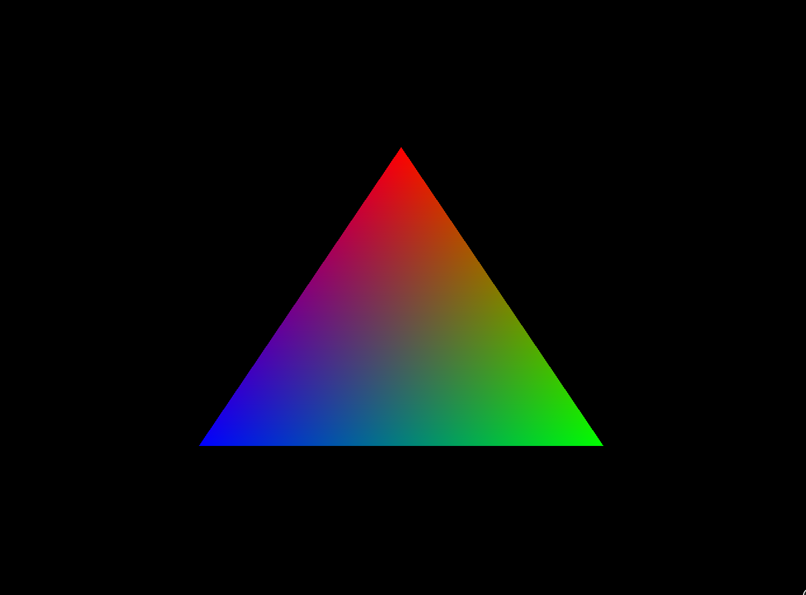

# vka

Learning Vulkan with [`ash`](https://github.com/MaikKlein/ash) using https://vulkan-tutorial.com.

Progress
---
- Drawing a Triangle
  - Setup
    - [Base code](https://github.com/al-jshen/vka/blob/4560023e3144840d33c5cfc0a177a11095535e03/src/main.rs)
    - [Instance](https://github.com/al-jshen/vka/blob/95931de5a2702d7e96ec1d4a758a6be7dc308484/src/main.rs)
    - [Validation layers](https://github.com/al-jshen/vka/blob/8eb4158a26213f129310723bf64286be2f896940/src/main.rs)
    - [Physical devices and queue families](https://github.com/al-jshen/vka/blob/dbc09b4db3c7cdc78bc065c910331eb043f7fe1c/src/main.rs)
    - [Logical device and queues](https://github.com/al-jshen/vka/blob/4f9a523d47d40282d43d3ea528f82756a29a04aa/src/main.rs)
  - Presentation
    - [Window surface](https://github.com/al-jshen/vka/blob/d1c394defc53eb6c581786602daa80879cdc918e/src/main.rs)
    - [Swapchain](https://github.com/al-jshen/vka/blob/a585abefde93c5ea4d60fe4bbfe9e2a23e713e7e/src/main.rs)
    - [Image views](https://github.com/al-jshen/vka/blob/179b44ad4543784f62d9623d98867269046c85aa/src/main.rs)
  - Graphics pipeline basics
    - [Shader modules](https://github.com/al-jshen/vka/tree/98c4d04a86cc10be4826c6a98521c702e1f96a55)
    - [Fixed functions](https://github.com/al-jshen/vka/tree/7c0a5b2fb19be396c131897bdc0933c685871bd9)
    - Render passes (forgot to commit here)
    - [Conclusion](https://github.com/al-jshen/vka/tree/517ebad95a2d1c9faa23f9d012383c7a55a0baab)
  - Drawing
    - [Framebuffers](https://github.com/al-jshen/vka/tree/3ba5120178d1c012df46ab94c54f29a64e8ad4e7)
    - [Command buffers](https://github.com/al-jshen/vka/tree/14aaba1e8d61db81df7fc945de87106d79e8be60)
    - [Rendering and presentation](https://github.com/al-jshen/vka/tree/3915c015aae7c5c2d2bea85b49d2a0dce9b54c05)
  
Results
---

